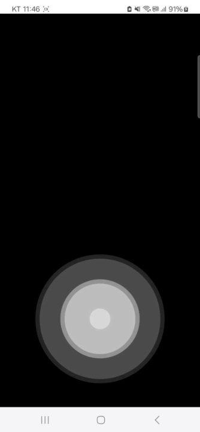
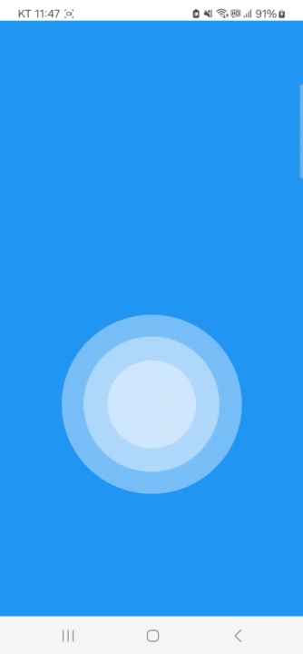

# React Native Auto Ripple

A customizable ripple animation component for React Native applications. This component creates an expanding circular ripple effect that can be used for various UI interactions.

## Preview

### Basic Ripple Effect


### Custom Styled Ripple


## Features

- Customizable ripple size and animation speed
- Multiple concurrent ripples
- Configurable ripple color and opacity
- Flexible positioning with style props
- TypeScript support

## Installation

```bash
# Using npm
npm install react-native-auto-ripple

# Using yarn
yarn add react-native-auto-ripple
```

## Usage

```jsx
import Ripple from 'react-native-auto-ripple';

const App = () => {
  return (
    <View style={styles.container}>
      <Ripple
        onPress={() => console.log('Ripple pressed!')}
        color="white"
        diameter={500}
        rippleCount={3}
      />
    </View>
  );
};
```

## Props

| Prop | Type | Default | Description |
|------|------|---------|-------------|
| `onPress` | `() => void` | `() => {}` | Callback function triggered when the ripple is pressed |
| `speed` | `number` | `10` | Animation speed of the ripple effect |
| `initialDiameter` | `number` | `0` | Initial diameter of the ripple |
| `diameter` | `number` | `500` | Maximum diameter of the ripple |
| `duration` | `number` | `1000` | Duration of each ripple animation (in milliseconds) |
| `rippleCount` | `number` | `3` | Number of ripples to display |
| `color` | `string` | `'white'` | Color of the ripple effect |
| `rippleStyle` | `ViewStyle` | `{}` | Additional styles for the ripple |
| `style` | `ViewStyle` | `{}` | Container style for the component |

## Complete Example

```jsx
import React from 'react';
import { View, StyleSheet } from 'react-native';
import Ripple from 'react-native-auto-ripple';

const Example = () => {
  return (
    <View style={styles.container}>
      <Ripple
        color="rgba(255, 255, 255, 0.8)"
        diameter={300}
        duration={800}
        rippleCount={5}
        speed={8}
        style={styles.ripple}
      />
    </View>
  );
};

const styles = StyleSheet.create({
  container: {
    flex: 1,
    backgroundColor: '#2196F3',
  },
  ripple: {
    position: 'absolute',
    bottom: 20,
  },
});

export default Example;
```

## License

MIT

## Contributing

Contributions are welcome! Please feel free to submit a Pull Request.